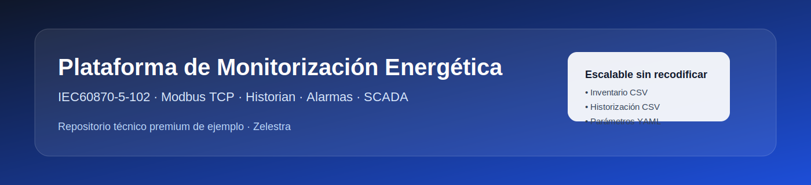
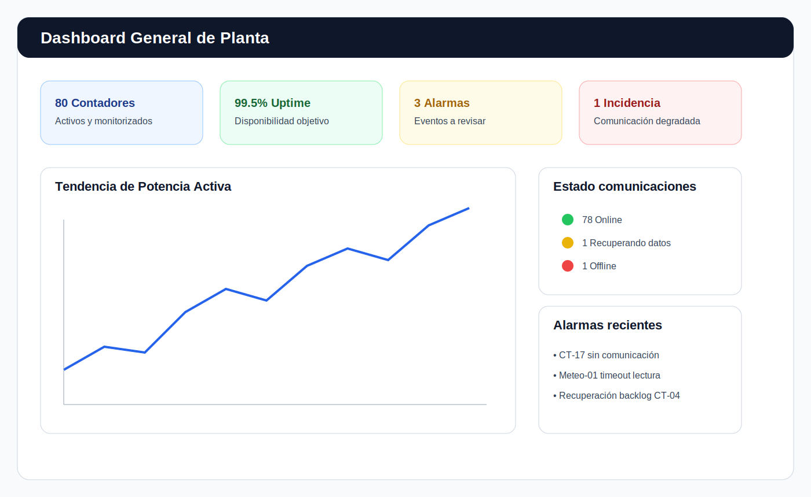
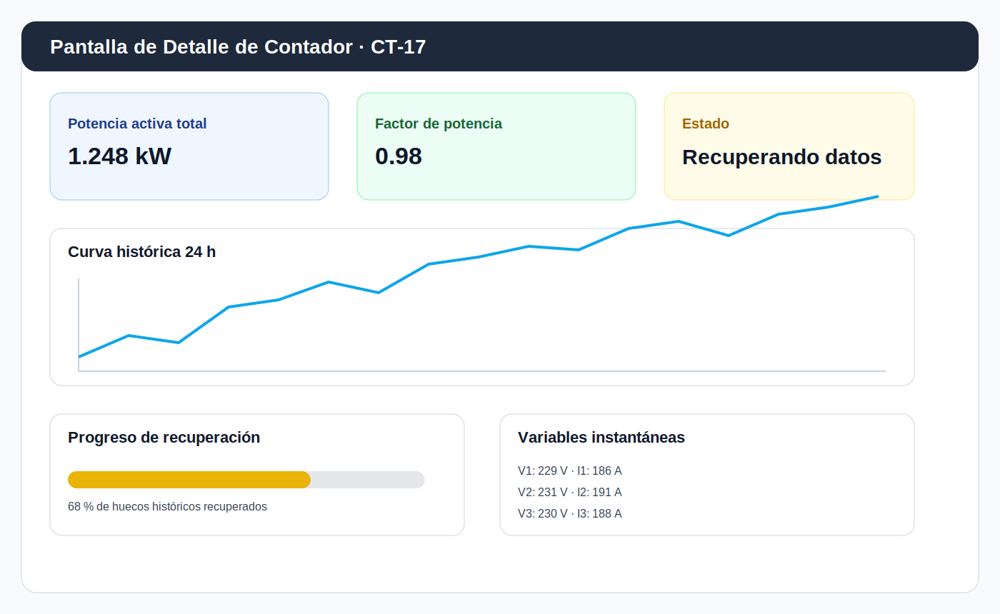
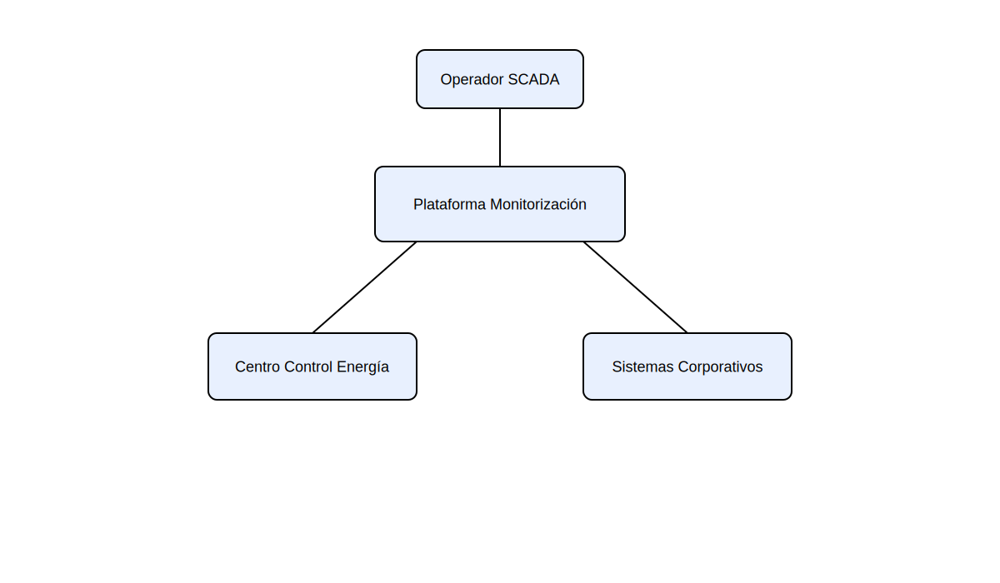
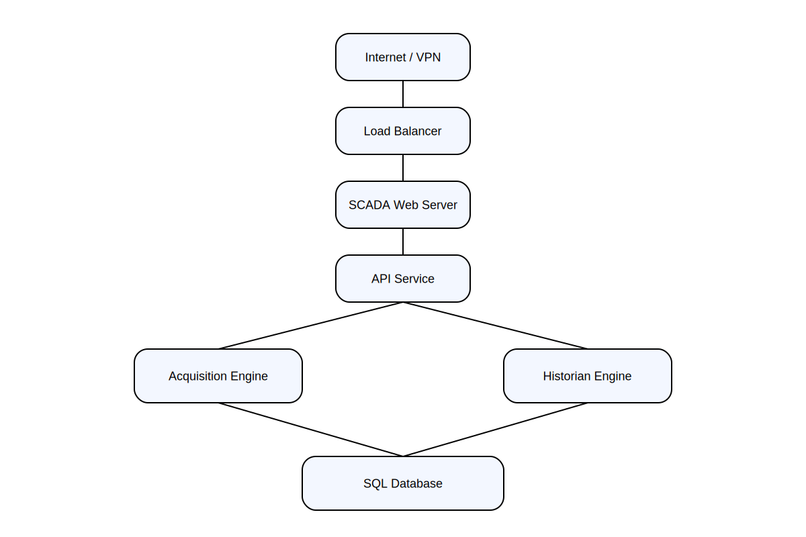
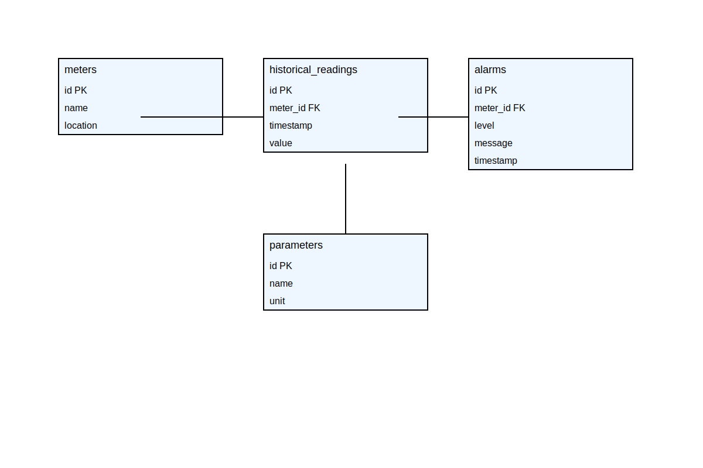

# ⚡ Plataforma de Monitorización Energética para Plantas Fotovoltaicas
### Sistema de adquisición IEC60870-5-102, historización y visualización SCADA

<p align="center">
  
</p>

<p align="left">
  
  
  
  
  
  
</p>

---

## ✨ Resumen ejecutivo

Solución software industrial diseñada para la **monitorización energética de plantas solares**, con adquisición de datos desde contadores **IEC60870-5-102** y estaciones meteorológicas **Modbus TCP**, historización, alarmas, visualización SCADA e integración con sistemas externos.

### ✅ Qué aporta esta plataforma
- Monitorización en tiempo real
- Historización energética
- Recuperación automática de datos perdidos
- Gestión básica de alarmas
- Visualización SCADA
- Integración con centros de control
- Arquitectura modular y mantenible
- Capacidad de crecimiento sin reprogramación
- Propiedad intelectual del cliente

---

## 📚 Índice

- [✨ Resumen ejecutivo](#-resumen-ejecutivo)
- [🖼️ Vistas de producto](#️-vistas-de-producto)
- [🧭 Visión general](#-visión-general)
- [🚀 Características principales](#-características-principales)
- [🏗️ Arquitectura general del sistema](#️-arquitectura-general-del-sistema)
- [🧩 Diagrama C4 visual](#-diagrama-c4-visual)
- [☁️ Arquitectura estilo Cloud / AWS](#️-arquitectura-estilo-cloud--aws)
- [🗄️ Modelo de datos y UML](#️-modelo-de-datos-y-uml)
- [🌊 Flujo de datos](#-flujo-de-datos)
- [🔧 Configuración](#-configuración)
- [🗂️ Estructura del repositorio GitHub](#️-estructura-del-repositorio-github)
- [⚙️ Prerrequisitos](#️-prerrequisitos)
- [🛠️ Instalación](#️-instalación)
- [📈 Observabilidad](#-observabilidad)
- [🔄 DevOps / CI](#-devops--ci)
- [📋 SLA recomendado](#-sla-recomendado)
- [🔐 Propiedad intelectual](#-propiedad-intelectual)

---

## 🖼️ Vistas de producto

### Dashboard general de planta

<p align="center">
  
</p>

### Pantalla de detalle por contador

<p align="center">
  
</p>

---

## 🧭 Visión general

La plataforma se concibe como una solución de ingeniería software de propósito industrial, pensada para operar con continuidad y ser mantenida a largo plazo.

### Principios de diseño
- **Claridad arquitectónica**
- **Modularidad**
- **Escalabilidad**
- **Observabilidad**
- **Transferencia de conocimiento**
- **Independencia tecnológica del cliente**
- **Crecimiento mediante configuración, no mediante recodificación**

> Esta documentación está pensada para que un tercero pueda comprender la arquitectura, desplegar el sistema y mantenerlo con garantías razonables.

---

## 🚀 Características principales

| Área | Capacidades |
|---|---|
| Adquisición | IEC60870-5-102, Modbus TCP, polling configurable |
| Historización | Registro de variables eléctricas y meteorológicas |
| Integración | API, exportación de datos, integración con ROC/centros de control |
| Explotación | SCADA, pantallas de detalle, vista general, alarmas |
| Continuidad | Recuperación automática de huecos de datos |
| Escalabilidad | Alta de nuevos equipos y proyectos sin tocar código |
| Operación | Logs, métricas, observabilidad y soporte al mantenimiento |

---

## 🏗️ Arquitectura general del sistema

Separación en bloques funcionales para simplificar despliegue, operación y evolución.

```text
Campo → Adquisición → Procesado → Base de Datos → API/Integración → SCADA/UI
```

---

## 🧩 Diagrama C4 visual

<p align="center">
  
</p>

---

## ☁️ Arquitectura estilo Cloud / AWS

<p align="center">
  
</p>

---

## 🗄️ Modelo de datos y UML

<p align="center">
  
</p>

---

## 🌊 Flujo de datos

```text
Contador IEC102 / Estación Meteo
        ↓
Motor de adquisición
        ↓
Normalización y validación
        ↓
Historian / Alarm Engine
        ↓
Base de datos
        ↓
API / SCADA / Reporting / ROC
```

---

## 🔧 Configuración

La plataforma ha sido diseñada con un enfoque **data-driven**, de forma que la ampliación del sistema pueda realizarse **sin reprogramar ninguna línea de código**.

Esto permite incorporar en el futuro:

- nuevos contadores
- nuevas estaciones meteorológicas
- nuevas señales
- nuevos proyectos PSFV
- nuevos periodos de historización

mediante la edición de ficheros externos de configuración en **CSV** y **YAML**.

### Estructura de configuración

```text
config/
├── system.yaml
├── catalogs/
│   ├── meters.csv
│   ├── meter_historization.csv
│   └── meteo_stations.csv
└── templates/
    ├── meters.template.csv
    ├── meter_historization.template.csv
    └── meteo_stations.template.csv
```

### 1. Configuración general del sistema

Archivo principal:

```text
config/system.yaml
```

Ejemplo:

```yaml
database:
  host: localhost
  port: 5432
  name: scada_monitoring
  user: scada
  password: change_me

acquisition:
  polling_seconds_default: 5
  reconnect_seconds: 30
  quality_on_timeout: BAD

historian:
  default_retention_days: 3650
  batch_insert_size: 500

projects:
  meters_file: config/catalogs/meters.csv
  meter_historization_file: config/catalogs/meter_historization.csv
  meteo_stations_file: config/catalogs/meteo_stations.csv
```

Este fichero controla:

- conexión a base de datos
- tiempos generales de adquisición
- reintentos de comunicación
- política general de historización
- rutas a los CSV de inventario y parametrización

### 2. Inventario de contadores

Archivo:

```text
config/catalogs/meters.csv
```

Campos:

- `link_address` → Dirección de enlace
- `measurement_point` → Punto de medida
- `ip_address` → Dirección IP
- `tcp_port` → Puerto TCP
- `meter_name` → Nombre del contador
- `physical_location` → Ubicación física
- `psfv_project` → Proyecto PSFV
- `enabled` → Habilitado / deshabilitado

Ejemplo:

```csv
link_address,measurement_point,ip_address,tcp_port,meter_name,physical_location,psfv_project,enabled
101,CT-01,10.20.1.11,2404,CONTADOR_CT_01,Centro de Transformación 01,PSFV_LLERENA,true
102,CT-02,10.20.1.12,2404,CONTADOR_CT_02,Centro de Transformación 02,PSFV_LLERENA,true
201,CT-15,10.30.4.21,2404,CONTADOR_CT_15,Centro de Transformación 15,PSFV_LEBRIJA,true
301,CT-03,10.40.2.13,2404,CONTADOR_CT_03,Centro de Transformación 03,PSFV_ISLA_MAYOR,false
```

### 3. Historización de variables por contador

Archivo:

```text
config/catalogs/meter_historization.csv
```

Campos:

- `meter_name`
- `signal_name`
- `historize`
- `sampling_seconds`
- `deadband`
- `enabled`

Ejemplo:

```csv
meter_name,signal_name,historize,sampling_seconds,deadband,enabled
CONTADOR_CT_01,ACTIVE_IMPORTED_KWH,true,900,0,true
CONTADOR_CT_01,ACTIVE_EXPORTED_KWH,true,900,0,true
CONTADOR_CT_01,VOLTAGE_PHASE_1,true,60,0.5,true
CONTADOR_CT_01,CURRENT_PHASE_1,true,60,0.2,true
CONTADOR_CT_01,POWER_ACTIVE_TOTAL,true,10,1.0,true
CONTADOR_CT_02,POWER_FACTOR_TOTAL,true,10,0.01,true
```

### 4. Inventario de estaciones meteorológicas

Archivo:

```text
config/catalogs/meteo_stations.csv
```

Campos:

- `ip_address`
- `tcp_port`
- `station_name`
- `physical_location`
- `psfv_project`
- `enabled`

Ejemplo:

```csv
ip_address,tcp_port,station_name,physical_location,psfv_project,enabled
10.50.1.10,502,METEO_01,Zona Norte,PSFV_LLERENA,true
10.50.1.11,502,METEO_02,Zona Sur,PSFV_LLERENA,true
10.60.2.10,502,METEO_03,Subcampo Este,PSFV_LEBRIJA,true
```

### Beneficios de este enfoque

- alta de nuevos equipos sin desarrollo
- activación y desactivación por configuración
- reutilización de la misma aplicación en múltiples plantas
- reducción de dependencia del desarrollador original
- mantenimiento más sencillo por terceros

---

## 🗂️ Estructura del repositorio GitHub

```text
Ejemplo-README.md-App-Zelestra-PREMIUM-CONFIG/
├── README.md
├── assets/
│   ├── banner/
│   └── mockups/
├── diagrams/
├── docs/
├── src/
├── database/
├── config/
│   ├── system.yaml
│   ├── catalogs/
│   └── templates/
├── scripts/
└── tests/
```

---

## ⚙️ Prerrequisitos

- CPU: **4 cores** mínimo
- RAM: **16 GB** recomendados
- Disco: **SSD**
- Linux o Windows Server
- PostgreSQL o MySQL

---

## 🛠️ Instalación

```bash
git clone https://github.com/txpto/Ejemplo-README.md-App-Zelestra.git
cd Ejemplo-README.md-App-Zelestra
pip install -r requirements.txt
```

---

## 📈 Observabilidad

- Prometheus
- Grafana
- Logs centralizados
- Alertas por eventos críticos

---

## 🔄 DevOps / CI

```text
GitHub → CI Pipeline → Tests → Build → Artefactos → Despliegue controlado
```

---

## 📋 SLA recomendado

- **Crítica**: < 4 horas
- **Media**: < 24 horas
- **Baja**: < 72 horas

---

## 🔐 Propiedad intelectual

Todo el software desarrollado es **propiedad del cliente**, incluyendo código fuente, arquitectura, documentación, diagramas y scripts.

---

**Ingeniería e Instalaciones Industriales del Maresme S.L.**  
Departamento de Ingeniería de Automatización
